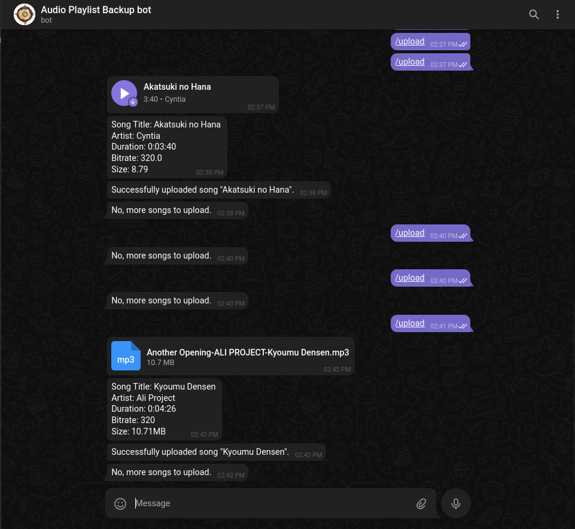

# Telegram Song uploader bot

This is a simple telegram bot I made to back up and share my song playlist through telegram.

## How to use:
1. Fork this GitHub repository
2. Clone your forked repository
3. install requirements using `pip install -r requirements.txt`
4. in Telegram, talk to @BotFather and create a new bot.
   1. send `/start` to @BotFather
   2. send `/newbot` to @BotFather
   3. send a name for your bot
   4. send a username for your bot
   5. Now, you will get a token for your bot. Save it somewhere.
      1. Note this token is your bots API token. It is like a password. Do not share it with anyone.
      2. from now own this token will be referred to as `API_TOKEN`
5. Now, in your cloned repository, open bot.py and replace `APITOKENPATH` with your path where you 
   have saved your `API_TOKEN`. (Note this is a path to file where you have stored your `API_TOKEN` and 
   should contain file name.)
6. Replace `SONG_DIR` with variable to where you have your songs(it's directory path and should not 
   contain file name.)
7. run this command `python bot.py`
8. That's all, Add your bot to any group and send `/start` to start using the bot.

### Note: Sometimes the script might stop uploading for no apparent reason. In that case, just resend the `/upload` command.
### Note: You can also use this bot in private chat.

## Commands:
- `/start` - Start the bot
- `/unknown` - handles unknown commands
- `/upload` - Uploads the song to the telegram group.